# Internal Knowledge Assistant

## About

This is a premium AI-powered internal knowledge assistant designed to help you answer questions based on your Google Drive files using Retrieval Augmented Generation (RAG).

## Architecture Components

1. **UI**: Modern chat interface with glassmorphism and real-time feedback.
2. **Backend**: Flask (Python) with Gunicorn (Production).
3. **Frontend**: HTML5, Vanilla CSS, and JavaScript.
4. **RAG**: LlamaIndex (Hybrid search: Vector + BM25).
5. **Database**: Google Cloud Firestore (Managed).
6. **Vector Store**: Zilliz Cloud (Managed Milvus).
7. **Chat Model**: OpenAI (GPT-4.1 mini).
8. **Knowledge Base**: Google Drive folder integration.
9. **Analytics**: Opik tracing for observability.
10. **OCR Engine**: Tesseract OCR for high-fidelity scanning of images and non-searchable PDFs.

## Workflow

```mermaid
flowchart TD
    subgraph Auth["🔐 Authentication"]
        A[User] --> B[Google Sign-In]
        B --> C[Firebase Auth]
    end

    subgraph Setup["⚙️ Configuration"]
        C --> D[Enter OpenAI API Key]
        D --> E[Select Google Drive Folder]
        E --> F[Index Documents]
    end

    subgraph Chat["💬 Chat"]
        F --> G[Ask Question]
        G --> H{Router}
        H -->|Casual| I[Direct LLM Response]
        H -->|Knowledge| J[Hybrid Retrieval]
        J --> K[Rerank & Synthesize]
        K --> L[Answer + Citations]
    end

    L --> G
```



1. User signs in with Google via Firebase Auth.
2. User configures OpenAI API key and Google Drive folder ID.
3. User asks a question in the chat interface.
4. Backend retrieves relevant documents from **Zilliz Cloud** using hybrid search.
5. Large Language Model (OpenAI) synthesizes the answer from the retrieved context.
6. Responsive answers are returned with clickable citations and sources.

## Key Features

- **Google Drive Integration**: Seamlessly connect your Drive folders and index documents (Docs, PDFs, etc.) for instant retrieval.
- **Scalable Multi-Tenancy**: Built using a shared Zilliz Cloud (Milvus) collection with metadata isolation, ensuring high performance regardless of the number of users.
- **Hybrid Retrieval Engine**: Combines **Vector Search** (for semantic meaning) and **BM25 Search** (for keyword exact matches) to provide the most accurate context.
- **Intelligent OCR & Document Parsing**: Advanced multi-stage processing for PDFs and images. The system extracts digital text where available and automatically falls back to **Tesseract OCR** for scanned documents, ensuring comprehensive knowledge coverage with built-in caching and multi-threaded performance.
- **Advanced Observability with Opik**: Deeply integrated **Opik** tracing for debugging, evaluating, and monitoring LLM applications. Track every step of the RAG pipeline with production-ready dashboards and evaluation metrics.
- **Automated Synchronization**: Background scheduler periodically polls your Google Drive to keep the knowledge base up-to-date.

## Not Implemented Yet

1. **Platform & Ops**
   - API gateway rate limiting.
   - Feedback storage/analytics (feedback is logged only).
   - Advanced evaluation/metrics (accuracy, drift, hallucination scoring).
2. **Retrieval & Access**
   - Per-user ACL filtering in retrieval/indexing.
   - Change detection for Drive updates (currently re-indexes on schedule).
3. **LLM & Safety**
   - Context history, compression, and caching.
   - Additional LLM optimizations (context window management, caching, usage dashboards/alerting).
   - Full safety pipeline (policy checks, PII detection, prompt injection prevention, moderation, redaction).

---

## Installation & Local Development

### Prerequisites

- Python 3.9+
- A Zilliz Cloud account (for Vector Storage)
- A Firebase project (for Auth & Database)
- An OpenAI API key

### 1. Configuration

Create a `.env` file in the root directory by copying the `.env.template` file and filling in the required values:

```bash
cp .env.template .env
```

> **Note: Firebase Admin vs Client Config**
> - **Firebase Admin Credentials** (`FIREBASE_ADMIN_CREDENTIALS_PATH`): A service account private key used by the Python backend for token verification and Firestore access. This is a secret and must never be exposed.
> - **Firebase Client Config** (`FIREBASE_API_KEY`, etc.): Public identifiers used by the JavaScript frontend to initialize Firebase Auth for Google Sign-In. These are designed to be public and are safe to include in client-side code.

### 2. Run Locally

```bash
# Install dependencies
pip install -r requirements.txt

# Start the server
python app.py
```

The app will be available at `http://localhost:5001`.

---

## GCP Initial Project Setup (One-Time)

If you are setting up this project in a new Google Cloud Project, follow these steps to initialize the environment:

### 1. Enable Required APIs
```bash
gcloud services enable \
  run.googleapis.com \
  cloudbuild.googleapis.com \
  artifactregistry.googleapis.com \
  firestore.googleapis.com \
  iam.googleapis.com \
  secretmanager.googleapis.com \
  drive.googleapis.com
```

### 2. Create Artifact Registry
```bash
gcloud artifacts repositories create knowledge-assistant \
  --repository-format=docker \
  --location=us-west1 \
  --description="Docker repository for Internal Knowledge Assistant"
```

### 3. Configure Secret Manager (Consolidated Secrets)

All secrets are stored in a **single consolidated JSON secret** called `app-secrets`. This simplifies management and deployment.

**Option A: Use the helper script (recommended):**
```bash
# First, create individual secrets temporarily (if migrating from old setup)
# Then run the consolidation script:
chmod +x scripts/create-consolidated-secret.sh
./scripts/create-consolidated-secret.sh
```

**Option B: Create manually:**
```bash
# Create the consolidated secret with all configuration
cat > /tmp/app-secrets.json << 'EOF'
{
  "FIREBASE_ADMIN_CREDENTIALS": { ...your firebase service account JSON... },
  "GOOGLE_OAUTH_CLIENT": { ...your Google OAuth client JSON... },
  "MILVUS_URI": "https://your-endpoint.zillizcloud.com",
  "MILVUS_TOKEN": "your_milvus_token",
  "MILVUS_COLLECTION": "internal_knowledge_assistant",
  "OPIK_API_KEY": "your_opik_api_key",
  "OPIK_PROJECT_NAME": "internal-knowledge-assistant",
  "OPIK_ENABLED": "true",
  "GOOGLE_PICKER_API_KEY": "your_picker_api_key",
  "SECRET_KEY": "your_flask_secret_key",
  "FIRESTORE_DB": "internal-knowledge-assistant",
  "FIREBASE_API_KEY": "your_firebase_api_key",
  "FIREBASE_AUTH_DOMAIN": "your-project.firebaseapp.com",
  "FIREBASE_PROJECT_ID": "your-project-id",
  "FIREBASE_STORAGE_BUCKET": "your-project.appspot.com",
  "FIREBASE_MESSAGING_SENDER_ID": "123456789",
  "FIREBASE_APP_ID": "1:123456789:web:abcdef"
}
EOF

gcloud secrets create app-secrets --data-file=/tmp/app-secrets.json
rm /tmp/app-secrets.json
```

### 4. Setup IAM Permissions
Create a dedicated service account and grant it the minimum required permissions:
```bash
# Create service account
gcloud iam service-accounts create knowledge-assistant-runner

# Grant access to the consolidated secret
gcloud secrets add-iam-policy-binding app-secrets \
  --member="serviceAccount:knowledge-assistant-runner@[PROJECT_ID].iam.gserviceaccount.com" \
  --role="roles/secretmanager.secretAccessor"

# Grant access to Firestore
gcloud projects add-iam-policy-binding [PROJECT_ID] \
  --member="serviceAccount:knowledge-assistant-runner@[PROJECT_ID].iam.gserviceaccount.com" \
  --role="roles/datastore.user" \
  --condition=None

# Additional roles for Cloud Build (if using this account as the build service account)
gcloud projects add-iam-policy-binding [PROJECT_ID] \
  --member="serviceAccount:knowledge-assistant-runner@[PROJECT_ID].iam.gserviceaccount.com" \
  --role="roles/artifactregistry.writer" \
  --condition=None

gcloud projects add-iam-policy-binding [PROJECT_ID] \
  --member="serviceAccount:knowledge-assistant-runner@[PROJECT_ID].iam.gserviceaccount.com" \
  --role="roles/run.admin" \
  --condition=None

gcloud projects add-iam-policy-binding [PROJECT_ID] \
  --member="serviceAccount:knowledge-assistant-runner@[PROJECT_ID].iam.gserviceaccount.com" \
  --role="roles/iam.serviceAccountUser" \
  --condition=None

gcloud projects add-iam-policy-binding [PROJECT_ID] \
  --member="serviceAccount:knowledge-assistant-runner@[PROJECT_ID].iam.gserviceaccount.com" \
  --role="roles/logging.logWriter" \
  --condition=None
```

---

## Production Deployment (GCP Cloud Run)

This project is configured for automated deployment using **Google Cloud Build** and **Cloud Run**.

### 1. Automated CI/CD
The repository includes a `cloudbuild.yaml` file that:
- Builds the Docker image on every push to the `master` branch.
- Pushes the image to **Artifact Registry**.
- Deploys the container to **Cloud Run** in the `us-west1` region.

### 2. Secret Management
Sensitive credentials are not stored in the container. Instead, they are managed via **GCP Secret Manager** using a **single consolidated secret**:

- `app-secrets`: Mounted at `/secrets/app/secrets.json`

The application parses this JSON at startup and:
- Writes Firebase/Google OAuth credentials to temp files for libraries that require file paths
- Sets environment variables for other configuration values (Milvus, LangChain, etc.)

### 3. Deployment Command (Manual)
To trigger a manual build and deployment:
```bash
gcloud builds submit --config cloudbuild.yaml . --substitutions SHORT_SHA=$(git rev-parse --short HEAD)
```

### 3.1 Cloud Run Memory (Recommended)
OCR + RAG workloads exceed the default 512Mi. Set Cloud Run to 1Gi to avoid OOMs:
```bash
gcloud run services update internal-knowledge-assistant \
  --region us-west1 \
  --memory 1Gi
```

To bake this into a one-off manual deploy (instead of updating later), use:
```bash
gcloud run deploy internal-knowledge-assistant \
  --image us-west1-docker.pkg.dev/$PROJECT_ID/knowledge-assistant/app:$SHORT_SHA \
  --region us-west1 \
  --platform managed \
  --allow-unauthenticated \
  --service-account "knowledge-assistant-runner@$PROJECT_ID.iam.gserviceaccount.com" \
  --set-env-vars "FLASK_CONFIG=production,APP_SECRETS_PATH=/secrets/app/secrets.json" \
  --set-secrets "/secrets/app/secrets.json=app-secrets:latest" \
  --memory 1Gi
```

### 4. Custom Domain & Firebase
The application is live at: [https://internal-knowledge-assistant-cp35zlfwgq-uw.a.run.app/](https://internal-knowledge-assistant-cp35zlfwgq-uw.a.run.app/)

**Troubleshooting (403 Forbidden)**:
If you receive a 403 error when accessing the URL, ensure the service is public by running:
```bash
gcloud run services add-iam-policy-binding internal-knowledge-assistant \
  --member="allUsers" \
  --role="roles/run.invoker" \
  --region=us-west1
```

**Custom Domain**:
Update your DNS records to point `knowledge-assistant.arjuntheprogrammer.com` to the Cloud Run service.

**Important**: Ensure the production URL is added to:
1. **Firebase Console**: Auth > Settings > Authorized Domains.
2. **Google Cloud Console**: APIs & Services > Credentials > OAuth 2.0 Client IDs (Update Redirect URIs to include `/api/config/drive-oauth-callback`).

## Analytics and Monitoring (Opik & PostHog)

### Opik

Debug, evaluate, and monitor your LLM applications, RAG systems, and agentic workflows with tracing, eval metrics, and production-ready dashboards. Tracing is enabled by default in production.

> **Migration Note**: LangSmith was replaced with Opik for observability.

### PostHog (Coming Soon)
Token usage (Input, Thinking, Output) and user behavior analytics are integrated via PostHog.
To enable, add your API key to the Cloud Run environment variables:
`POSTHOG_API_KEY=your_key_here`

---

🎥 **YouTube Walkthrough**: https://youtu.be/mf2SiJLMSDY

[](https://youtu.be/mf2SiJLMSDY)

🔗 **Live Demo Link**: https://knowledge-assistant.arjuntheprogrammer.com
