# Internal Knowledge Assistant

## About

This is a premium AI-powered internal knowledge assistant designed to help you answer questions based on your Google Drive files using Retrieval Augmented Generation (RAG).

## Architecture Components

1. **UI**: Modern chat interface with glassmorphism and real-time feedback.
2. **Backend**: Flask (Python) with Gunicorn (Production).
3. **Frontend**: HTML5, Vanilla CSS, and JavaScript.
4. **RAG**: LlamaIndex (Hybrid search: Vector + BM25) with **Structured JSON Output** for deterministic evaluation.
5. **Database**: Google Cloud Firestore (Managed).
6. **Vector Store**: Zilliz Cloud (Managed Milvus).
7. **Chat Model**: OpenAI (GPT-4.1 mini).
8. **Knowledge Base**: Google Drive file selection.
9. **Analytics**: Opik tracing for observability.
10. **OCR Engine**: Tesseract OCR for high-fidelity scanning of images and non-searchable PDFs.

## Workflow

```mermaid
flowchart TD
    subgraph Auth["🔐 1. Authentication & Security"]
        A[User Access] --> B[Google Sign-In]
        B --> C[Firebase Authentication]
        C --> D[Retrieve ID Token]
        D --> E[Backend Verify Token]
    end

    subgraph Config["⚙️ 2. User Configuration"]
        E --> F[Enter OpenAI API Key]
        F --> G[Validate OpenAI Key]
        G --> H[Authorize Google Drive]
        H --> I[Select Specific Files/Folders]
    end

    subgraph Indexing["🗂️ 3. Knowledge Base Construction"]
        I --> J[Trigger Indexing Service]
        J --> K[Download Documents via Drive API]
        K --> L{Text Extraction}
        L -->|Digital PDF/Docx| M[Extract Raw Text]
        L -->|Image/Scanned PDF| N[Fallback: Tesseract OCR]
        M & N --> O[Sentence Splitting & Node Chunking]
        O --> P[Generate OpenAI Embeddings]
        P --> Q[Upload to Zilliz Cloud / Milvus]
        Q --> R[Update Catalog in Firestore]
    end

    subgraph Chat["💬 4. Intelligent Query Pipeline"]
        R --> S[User Asks Question]
        S --> T{Intent Classifier / Router}
        T -->|Casual| U[Casual Chat: LLM Direct Response]
        T -->|Knowledge| V[Knowledge Retrieval: Hybrid Engine]

        subgraph Retrieval["🔍 Hybrid Search"]
            V --> V1[Semantic Vector Search]
            V --> V2[Keyword BM25 Search]
            V1 & V2 --> V3[Reciprocal Rank Fusion]
            V3 --> V4[LLM-Based Reranking]
        end

        V4 --> W[Augment Prompt with Context]
        W --> X[Generate Structured JSON Response]
        X --> Y[Parse Citations & Source Mapping]
    end

    Y --> Z[Interactive UI Display + Clickable Sources]
    U --> Z
    Z --> S
```

1. User signs in with Google via Firebase Auth.
2. User completes setup: validate OpenAI API key, authorize Drive, and select files.
3. User builds the database (documents are indexed with progress feedback).
4. Chat is enabled only after configuration is complete.
5. User asks a question in the chat interface.
6. Backend retrieves relevant documents from **Zilliz Cloud** using hybrid search.
7. Large Language Model (OpenAI) synthesizes the answer from the retrieved context.
8. Responsive answers are returned with clickable citations and sources.

## Key Features

- **Google Drive Integration**: Seamlessly connect your Drive files and build the searchable database for instant retrieval.
- **Scalable Multi-Tenancy**: Built using a shared Zilliz Cloud (Milvus) collection with metadata isolation, ensuring high performance regardless of the number of users.
- **Hybrid Retrieval Engine**: Combines **Vector Search** (for semantic meaning) and **BM25 Search** (for keyword exact matches) to provide the most accurate context.
- **Intelligent OCR & Document Parsing**: Advanced multi-stage processing for PDFs and images. The system extracts digital text where available and automatically falls back to **Tesseract OCR** for scanned documents, ensuring comprehensive knowledge coverage with built-in caching and multi-threaded performance.
- **Advanced Observability with Opik**: Deeply integrated **Opik** tracing and **Prompt Library**. Track every step of the RAG pipeline, manage prompt versions, and run high-concurrency evaluations.
- **Automated Synchronization**: Background scheduler periodically polls your Google Drive to keep the knowledge base up-to-date.

## Not Implemented Yet

1. **Platform & Ops**
   - API gateway rate limiting.
   - Feedback storage/analytics (feedback is logged only).
   - Advanced evaluation/metrics (accuracy, drift, hallucination scoring).
2. **Retrieval & Access**
   - Per-user ACL filtering in retrieval/indexing.
   - Change detection for Drive updates (currently re-indexes on schedule).
3. **LLM & Safety**
   - Context history, compression, and caching.
   - Additional LLM optimizations (context window management, caching, usage dashboards/alerting).
   - Full safety pipeline (policy checks, PII detection, prompt injection prevention, moderation, redaction).

---

---

## 🚀 Getting Started

### Local Development
Follow the **[Local Setup Guide](docs/LOCAL.md)** to get the application running on your machine.

### Production Deployment
For information on setting up the GCP environment and deploying to Cloud Run, see the **[Production & Deployment Guide](docs/PRODUCTION.md)**.

### Technical Documentation
Learn more about the retrieval pipeline and optimizations in the **[RAG Documentation](docs/RAG.md)**.

---

## Analytics and Monitoring (Opik)

### Opik

Debug, evaluate, and monitor your LLM applications, RAG systems, and agentic workflows with tracing, eval metrics, and production-ready dashboards.
- **Prompt Library**: Centralized management and versioning of LLM prompts.
- **Structured Evals**: Automated evaluation pipeline with asynchronous execution and structured metadata mapping.
- **Trace Attribution**: Every query is linked to the exact prompt version and hash used.

> **Migration Note**: LangSmith was replaced with Opik for observability.

---

🎥 **YouTube Walkthrough**: https://youtu.be/mf2SiJLMSDY

🔗 **Live Demo Link**: https://knowledge-assistant.arjuntheprogrammer.com
