# RAG in internal-knowledge-assistant

This document explains how Retrieval-Augmented Generation (RAG) is implemented in
this repo and the optimizations added to improve answer quality, coverage, and
reliability.

## High-level flow

1. The API receives a chat message at `POST /api/chat/message`.
2. The message is wrapped in a `QueryBundle` (see `backend/routes/chat.py`).
3. `RAGService.query(...)` routes the request:
   - Casual chit-chat goes to a lightweight LLM-only engine.
   - Knowledge queries go to the retrieval engine.
4. The retrieval engine pulls documents from Google Drive files, chunks
   them, runs hybrid retrieval (vector + BM25), then reranks and synthesizes a
   grounded answer.

## Core components

- `backend/services/rag/rag.py`
  - `RAGService` orchestrates indexing, retrieval, routing, and fallback logic.
- `backend/services/rag/engines.py`
  - `CasualQueryEngine`: small-talk responses without retrieval.
  - `LazyRAGQueryEngine`: builds the retrieval query engine on demand.
- `backend/services/rag/retrievers.py`
  - `HybridRetriever`: merges vector and BM25 results.
- `backend/services/rag/catalog.py`
  - Document catalog and list fallback helpers.
- `backend/services/rag/rag_context.py`
  - LLM + embedding configuration.
- `backend/services/rag/rag_google_drive.py`
  - Google Drive loader + auth helpers.

## Data sources

- Google Drive files (loaded via `rag_google_drive.load_google_drive_documents_by_file_ids()`).

Each document is annotated with metadata (e.g., file name) and indexed.

## Retrieval pipeline

```mermaid
flowchart TD
    %% Nodes
    Docs[📥 Google Drive] --> Split[✂️ Chunk & Embed]
    Split --> Milvus[(🗄️ Zilliz Milvus)]

    User([❓ User Query]) --> Hybrid{🔍 Hybrid Search}

    Milvus -.->|Vector| Hybrid
    Split -.->|BM25| Hybrid

    Hybrid --> Rank[🎯 LLM Rerank]
    Rank --> Synth[✍️ Refine & Synthesize]
    Synth --> Ans([✅ Answer + Sources])

    %% Styling
    style Milvus fill:#fff9c4,stroke:#fbc02d
    style Ans fill:#e8f5e9,stroke:#2e7d32
    style User fill:#e1f5fe,stroke:#0288d1
```

1. **Chunking**
   - `SentenceSplitter(chunk_size=512, chunk_overlap=60)` splits documents into
     manageable chunks.
2. **Vector store**
   - Zilliz Cloud (Milvus) is used as the vector backend (`backend/services/rag/rag_milvus.py`).
   - Multi-tenancy is achieved via a shared collection with `user_id` metadata filtering.
   - Each user's documents are tagged with their `user_id` and queries filter by this field.
3. **Hybrid retrieval**
   - Vector retriever + BM25 retriever are merged in `HybridRetriever`.
4. **Reranking**
   - `LLMRerank` refines top results before answer synthesis.
5. **Answer synthesis**
   - Uses task-specific prompts for list vs non-list queries and a refine step.

## Document and Node Identity

The system uses a **file-centric identity model** to ensure consistent tracking of documents and their chunks across different ingestion methods (standard vs OCR).

### 1. Document ID (`Document.id_`)
The canonical identity of any document in the system is its **Google Drive `file_id`**.
- Even if a document is split into multiple physical chunks during OCR (one per page), they all share the same `Document.id_`.
- This ensures that a single file in Google Drive corresponds to exactly one "logical document" in our catalog.

### 2. Node ID (`node.id_`)
Each indexed chunk (Node) has a deterministic, unique ID based on its context:
`{file_id}#rev:{revision_id}#p:{page_number}#m:{extraction_method}#c:{chunk_index}`

- **`file_id`**: Google Drive ID.
- **`revision_id`**: The modification timestamp or version identifier.
- **`page_number`**: The page index (1-indexed).
- **`extraction_method`**: Either `digital_text` or `ocr`.
- **`chunk_index`**: The sequential index of the chunk within that specific page.

This deterministic approach ensures that re-indexing the same file version results in identical node IDs, preventing duplicates and enabling stable evaluation.

### 3. Metadata
All granularity (page number, extraction method, etc.) is stored in metadata rather than encoded into the document ID. This allows for clean cataloging and filtering while retaining the ability to trace an answer back to a specific page or source.

## Query routing (casual vs retrieval)

`RouterQueryEngine` + `LLMSingleSelector` choose between:

- `casual_chat`: greeting, thanks, small talk (no retrieval).
- `knowledge_base_retrieval`: anything that needs documents or facts.

This keeps small talk fast and cheap while reserving retrieval for grounded
questions.

## Optimizations added to improve output

1. **Hybrid retrieval (BM25 + vector)**
   - Captures both exact keyword matches and semantic similarity.
   - Particularly useful for list queries and domain-specific names.
2. **Reranking with LLM**
   - Improves relevance of retrieved chunks before synthesis.
3. **List-specific prompts**
   - Dedicated prompt template for list queries with explicit instructions to
     enumerate all unique items and avoid early truncation.
4. **Adaptive retrieval depth**
   - `top_k` and `max_results` are higher for list queries (more recall).
5. **Document catalog fallback**
   - When the RAG answer is empty or incomplete for list requests, a catalog
     built from document metadata is returned.
6. **Router multi-selection safety**
   - Router selection metadata is handled safely even if multiple tools are
     returned by the selector.

## LLM and embeddings

- OpenAI:
  - LLM default: `gpt-4.1-mini`
  - Embeddings: `text-embedding-3-small`

Configuration is in `backend/services/rag/rag_context.py` and is supplied per
user from Firestore (OpenAI API key + Drive file IDs).

## Telemetry (Opik)

Debug, evaluate, and monitor your LLM applications, RAG systems, and agentic
workflows with tracing, eval metrics, and production-ready dashboards.

Tracing is enabled when `OPIK_API_KEY` is configured (set `OPIK_ENABLED=false`
to disable). The callback handler lives in `backend/services/opik_tracing.py`
and is attached in `rag_context.py`.

> **Migration Note**: LangSmith was replaced with Opik for observability.

## Notes for Docker builds

BM25 uses `pystemmer`, which requires build tools inside the container. The
backend Docker image installs `build-essential` before installing Python deps
(`backend/Dockerfile`).

## Quick sanity checks

- Start services: `docker compose up --build -d`
- Run API tests: `conda run -n internal-knowledge-assistant python scripts/tests/rag_api_tests.py`

## File map (entry points)

- `backend/routes/chat.py`: main chat API.
- `backend/services/rag/rag.py`: RAG orchestration and routing.
- `backend/services/rag/rag_google_drive.py`: Google Drive ingestion.
- `backend/services/rag/rag_context.py`: LLM + embed config.
