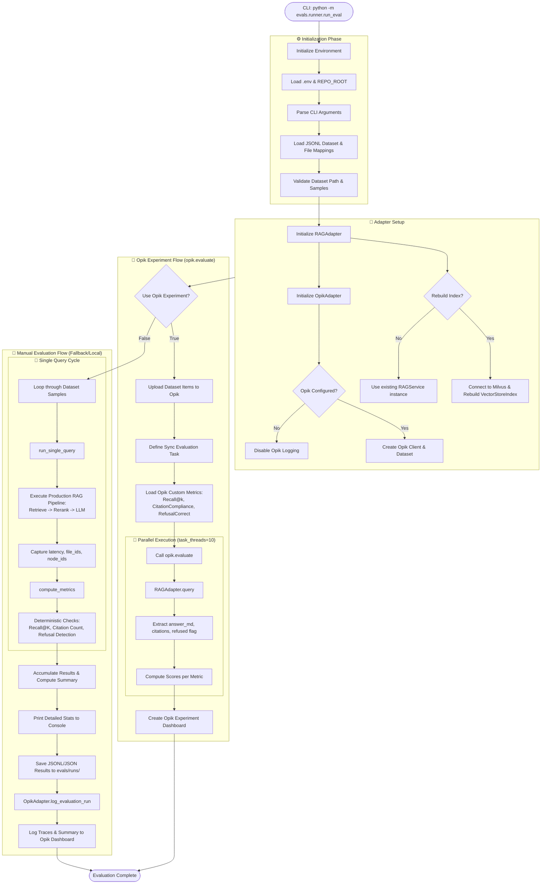

# RAG Evaluation Pipeline Diagram

This document provides a detailed, end-to-end explanation of how the RAG evaluation system works, focusing on the flow from CLI invocation to metric reporting and Opik integration.

## End-to-End Pipeline Flow

## Component Breakdown

### 1. The Runner (`run_eval.py`)
The orchestrator. It manages the two distinct evaluation branches:
- **Experiment Mode**: Modern, parallelized evaluation leveraging the Opik SDK's comparison features.
- **Manual Mode**: Classic sequential loop useful for local debugging and saving results to disk.

### 2. The RAG Adapter (`adapters.py`)
The bridge to the production system. It ensures that evaluations run against the **exact same code** that users interact with.
- It initializes the `RAGService`.
- It converts the production `SystemOutput` back into a format suitable for metric calculation.

### 3. Metric Engines (`metrics.py` & `opik_metrics.py`)
- **Deterministic Metrics**: Fast, rule-based checks for recall (are the right files found?) and citation compliance (did it cite them correctly?).
- **Refusal Correctness**: Specialized logic to verify that the system refuses exactly when it should (out-of-scope) and answers exactly when it can (grounded).

### 4. Opik Integration
- **Datasets**: Versioned collections of input queries and expected outputs.
- **Experiments**: Side-by-side comparisons of different system versions.
- **Tracing**: High-fidelity logs of internal retrieval steps and LLM intermediate outputs.
