# RAG Evaluation Framework

This folder contains the evaluation framework for the Internal Knowledge Assistant RAG system.

## Overview

The evaluation framework runs a dataset of queries against the RAG system and computes deterministic metrics for:
- **Retrieval quality** (Recall@k)
- **Citation compliance**
- **Refusal correctness** (for out-of-scope queries)

Results are logged to **Opik** for tracking and visualization.

## End-to-End Pipeline Flow

```mermaid
flowchart TD
    Start([CLI: python -m evals.runner.run_eval]) --> Init[Initialize Environment]

    subgraph Initialization ["⚙️ Initialization Phase"]
        Init --> LoadEnv[Load .env & REPO_ROOT]
        LoadEnv --> Args[Parse CLI Arguments]
        Args --> LoadDataset[Load JSONL Dataset & File Mappings]
        LoadDataset --> Validate[Validate Dataset Path & Samples]
    end

    subgraph Adapters ["🔌 Adapter Setup"]
        Validate --> InitRAGAdapter[Initialize RAGAdapter]
        InitRAGAdapter --> RebuildIndex{Rebuild Index?}
        RebuildIndex -->|Yes| Milvus[Connect to Milvus & Rebuild VectorStoreIndex]
        RebuildIndex -->|No| RAGService[Use existing RAGService instance]

        InitRAGAdapter --> InitOpikAdapter[Initialize OpikAdapter]
        InitOpikAdapter --> OpikConfig{Opik Configured?}
        OpikConfig -->|Yes| OpikClient[Create Opik Client & Dataset]
        OpikConfig -->|No| OpikDisabled[Disable Opik Logging]
    end

    Adapters --> EvalMode{Use Opik Experiment?}

    subgraph OpikExperiment ["🔬 Opik Experiment Flow (opik.evaluate)"]
        EvalMode -->|True| UploadItems[Upload Dataset Items to Opik]
        UploadItems --> DefineTask[Define Sync Evaluation Task]
        DefineTask --> ScoringMetrics[Load Opik Custom Metrics:<br/>Recall@k, CitationCompliance, RefusalCorrect]
        ScoringMetrics --> Evaluate[Call opik.evaluate]

        subgraph InternalThread ["🔄 Parallel Execution (task_threads=10)"]
            Evaluate --> QueryRAG[RAGAdapter.query]
            QueryRAG --> RAGResult[Extract answer_md, citations, refused flag]
            RAGResult --> Score[Compute Scores per Metric]
        end

        Score --> ExperimentResult[Create Opik Experiment Dashboard]
    end

    subgraph ManualEval ["📝 Manual Evaluation Flow (Fallback/Local)"]
        EvalMode -->|False| ManualLoop[Loop through Dataset Samples]

        subgraph SampleProcessing ["🔄 Single Query Cycle"]
            ManualLoop --> RunQuery[run_single_query]
            RunQuery --> ProductionRAG[Execute Production RAG Pipeline:<br/>Retrieve -> Rerank -> LLM]
            ProductionRAG --> Capture[Capture latency, file_ids, node_ids]
            Capture --> LocalMetrics[compute_metrics]
            LocalMetrics --> Deterministic[Deterministic Checks:<br/>Recall@K, Citation Count, Refusal Detection]
        end

        Deterministic --> Accumulate[Accumulate Results & Compute Summary]
        Accumulate --> PrintSummary[Print Detailed Stats to Console]
        PrintSummary --> SaveLocal[Save JSONL/JSON Results to evals/runs/]
        SaveLocal --> LogTraces[No OpikAdapter fallback in manual mode currently]
    end

    ExperimentResult --> End([Evaluation Complete])
```



## Directory Structure

```
evals/
├── __init__.py
├── README.md              # This file
├── datasets/
│   ├── stock_eval_v1.jsonl    # Evaluation dataset
│   └── file_id_mapping.json   # File ID to filename mapping
├── runner/
│   ├── __init__.py
│   ├── opik/             # Opik integration package
│   │   ├── adapter.py    # Opik adapter class
│   │   ├── metrics.py    # Opik BaseMetric wrappers
│   │   ├── extract.py    # Experiment extraction util
│   │   └── manage.py     # Dataset management util
│   ├── run_eval.py        # Main CLI runner
│   ├── metrics.py         # Deterministic metrics
│   ├── rag_adapter.py     # RAG adapter
│   ├── schema.py          # Data schemas
│   └── ...
└── runs/                  # Output directory for results
```

## Latest Results: `eval_20260126_102917`

| Metric | Mean Score | Successful Samples |
| :--- | :---: | :---: |
| **Recall@5 / @10** | **1.0000** | 25 / 25 |
| **Recall-All@5** | 0.9240 | 25 / 25 |
| **Recall-All@10** | 0.9653 | 25 / 25 |
| **Citation Compliance** | 0.9400 | 25 / 25 |
| **Refusal Correctness** | 0.9600 | 25 / 25 |
| **Has Sources Section** | 0.8800 | 25 / 25 |

## Setup

### Prerequisites

1. Ensure you have the conda environment activated:
   ```bash
   conda activate internal-knowledge-assistant
   ```

2. Required environment variables in `.env`:
   ```bash
   # OpenAI API key for LLM and embeddings
   OPENAI_API_KEY=sk-...

   # Milvus/Zilliz configuration
   MILVUS_URI=https://...
   MILVUS_TOKEN=...
   MILVUS_COLLECTION=internal_knowledge_assistant

   # Opik configuration
   OPIK_API_KEY=...
   OPIK_EVAL_PROJECT_NAME=internal-knowledge-assistant-eval
   OPIK_ENABLED=true
   ```

## Running Evaluation

### Basic Usage

```bash
python -m evals.runner.run_eval --dataset evals/datasets/stock_eval_v1.jsonl
```

### Opik Dataset Management

```bash
# Sync Opik dataset with local JSONL
python -m evals.runner.opik.manage --dataset-name stock_eval_v1 --sync evals/datasets/stock_eval_v1.jsonl
```

### Result Extraction

```bash
# Extract results from Opik experiment
python -m evals.runner.opik.extract --experiment-name eval_20260126_102917
```

## Metrics

The framework uses a hybrid approach: local deterministic metrics for speed during manual runs, and **Opik Custom Metrics** for experiment dashboard visualization.

### Retrieval Metrics

Measures how effectively the system finds the required context.
- **Recall@5 / Recall@10**: Binary metric (1 or 0). 1 if *any* of the expected file IDs are present in the top-K retrieved documents. For refusal cases (no expected files), this is 1 if retrieval is empty.
- **Recall-All@5 / Recall-All@10**: Fractional metric. The percentage of *all* expected file IDs that were successfully retrieved in the top-K.

### Generation & Compliance Metrics

Leverages the structured `LLMOutput` metadata for high-precision validation.
- **Citation Compliance**: A composite score (0.0 to 1.0).
    - +0.5 if the "Sources" section is present.
    - +0.5 if the number of actual citations matches or exceeds `required_citations_count`.
- **Has Sources Section**: Dedicated check for the presence of the `**Sources:**` header in the markdown response.
- **Refusal Correctness**: Validates the system's "Self-Awareness".
    - 1.0 if the system correctly refuses an out-of-scope query.
    - 1.0 if the system correctly answers a grounded query.
    - 0.0 if it hallucinates an answer for an out-of-scope query (False Negative) or refuses a valid query (False Positive).

### Performance Metrics

- **Latency (ms)**: Total time taken from query submission to receiving the structured response, including retrieval, reranking, and LLM generation.
