# RAG Evaluation Framework

This folder contains the evaluation framework for the Internal Knowledge Assistant RAG system.

## Overview

The evaluation framework runs a dataset of queries against the RAG system and computes deterministic metrics for:
- **Retrieval quality** (Recall@k)
- **Citation compliance**
- **Refusal correctness** (for out-of-scope queries)

Results are logged to **Opik** for tracking and visualization.

## End-to-End Pipeline Flow

```mermaid
flowchart TD
    Start([CLI: python -m evals.runner.run_eval]) --> Init[Initialize Environment]

    subgraph Initialization ["⚙️ Initialization Phase"]
        Init --> LoadEnv[Load .env & REPO_ROOT]
        LoadEnv --> Args[Parse CLI Arguments]
        Args --> LoadDataset[Load JSONL Dataset & File Mappings]
        LoadDataset --> Validate[Validate Dataset Path & Samples]
    end

    subgraph Adapters ["🔌 Adapter Setup"]
        Validate --> InitRAGAdapter[Initialize RAGAdapter]
        InitRAGAdapter --> RebuildIndex{Rebuild Index?}
        RebuildIndex -->|Yes| Milvus[Connect to Milvus & Rebuild VectorStoreIndex]
        RebuildIndex -->|No| RAGService[Use existing RAGService instance]

        InitRAGAdapter --> InitOpikAdapter[Initialize OpikAdapter]
        InitOpikAdapter --> OpikConfig{Opik Configured?}
        OpikConfig -->|Yes| OpikClient[Create Opik Client & Dataset]
        OpikConfig -->|No| OpikDisabled[Disable Opik Logging]
    end

    Adapters --> EvalMode{Use Opik Experiment?}

    subgraph OpikExperiment ["🔬 Opik Experiment Flow (opik.evaluate)"]
        EvalMode -->|True| UploadItems[Upload Dataset Items to Opik]
        UploadItems --> DefineTask[Define Sync Evaluation Task]
        DefineTask --> ScoringMetrics[Load Opik Custom Metrics:<br/>Recall@k, CitationCompliance, RefusalCorrect]
        ScoringMetrics --> Evaluate[Call opik.evaluate]

        subgraph InternalThread ["🔄 Parallel Execution (task_threads=10)"]
            Evaluate --> QueryRAG[RAGAdapter.query]
            QueryRAG --> RAGResult[Extract answer_md, citations, refused flag]
            RAGResult --> Score[Compute Scores per Metric]
        end

        Score --> ExperimentResult[Create Opik Experiment Dashboard]
    end

    subgraph ManualEval ["📝 Manual Evaluation Flow (Fallback/Local)"]
        EvalMode -->|False| ManualLoop[Loop through Dataset Samples]

        subgraph SampleProcessing ["🔄 Single Query Cycle"]
            ManualLoop --> RunQuery[run_single_query]
            RunQuery --> ProductionRAG[Execute Production RAG Pipeline:<br/>Retrieve -> Rerank -> LLM]
            ProductionRAG --> Capture[Capture latency, file_ids, node_ids]
            Capture --> LocalMetrics[compute_metrics]
            LocalMetrics --> Deterministic[Deterministic Checks:<br/>Recall@K, Citation Count, Refusal Detection]
        end

        Deterministic --> Accumulate[Accumulate Results & Compute Summary]
        Accumulate --> PrintSummary[Print Detailed Stats to Console]
        PrintSummary --> SaveLocal[Save JSONL/JSON Results to evals/runs/]
        SaveLocal --> LogTraces[OpikAdapter.log_evaluation_run]
        LogTraces --> TraceOpik[Log Traces & Summary to Opik Dashboard]
    end

    ExperimentResult --> End([Evaluation Complete])
    TraceOpik --> End
```



## Directory Structure

```
evals/
├── __init__.py
├── README.md              # This file
├── datasets/
│   ├── stock_eval_v1.jsonl    # Evaluation dataset
│   └── file_id_mapping.json   # File ID to filename mapping
├── runner/
│   ├── __init__.py
│   ├── run_eval.py        # Main CLI runner
│   ├── metrics.py         # Metric computation
│   ├── opik_metrics.py    # Opik-specific metric wrappers
│   ├── adapters.py        # RAG and Opik adapters
│   └── schema.py          # Data schemas
└── runs/                  # Output directory for results
    └── <timestamp>_results.jsonl
    └── <timestamp>_summary.json
```

## Setup

### Prerequisites

1. Ensure you have the conda environment activated:
   ```bash
   conda activate internal-knowledge-assistant
   ```

2. Required environment variables in `.env`:
   ```bash
   # OpenAI API key for LLM and embeddings
   OPENAI_API_KEY=sk-...

   # Milvus/Zilliz configuration
   MILVUS_URI=https://...
   MILVUS_TOKEN=...
   MILVUS_COLLECTION=internal_knowledge_assistant

   # Opik configuration
   OPIK_API_KEY=...
   OPIK_EVAL_PROJECT_NAME=internal-knowledge-assistant-eval  # Default for evaluations
   OPIK_ENABLED=true

   # Optional: Default User for evals
   EVAL_USER_ID=NUsot0aGhVMGEEnu9RujAPSRXtv2
   ```

3. The user must have indexed documents. Use the default `EVAL_USER_ID` or provide your own.

## Running Evaluation

### Basic Usage

Running with default user and dataset:
```bash
python -m evals.runner.run_eval
```

Running a specific dataset for a specific user:
```bash
python -m evals.runner.run_eval \
  --dataset evals/datasets/stock_eval_v1.jsonl \
  --user-id <firebase_user_id>
```

### Full Options

```bash
python -m evals.runner.run_eval \
  --dataset evals/datasets/stock_eval_v1.jsonl \
  --user-id <firebase_user_id> \
  --opik-project internal-knowledge-assistant-eval \
  --opik-dataset stock_eval_v1 \
  --limit 5  # For testing
```

### CLI Arguments

| Argument | Required | Default | Description |
|----------|----------|---------|-------------|
| `--dataset` | No | `evals/datasets/stock_eval_v1.jsonl` | Path to JSONL dataset file |
| `--user-id` | No | `EVAL_USER_ID` or `NUsot...` | Firebase user ID for retrieval context |
| `--opik-project` | No | `OPIK_EVAL_PROJECT_NAME` | Opik project name |
| `--opik-dataset` | No | `stock_eval_v1` | Opik dataset name |
| `--use-opik-experiment` | No | `True` | Use `opik.evaluate()` for proper Experiments |
| `--no-opik` | No | `False` | Disable Opik logging |
| `--openai-key` | No | From env | OpenAI API key |
| `--limit` | No | None | Limit samples (for testing) |

## Dataset Format

The dataset is JSONL format with one query per line:

```json
{
  "id": "q_001",
  "query": "Summarize HCL Technologies Limited in 3 bullet points.",
  "intent": "summary",
  "expected_file_ids": ["15vxlJ7LtoIzNcoLs5WzZgFN3vro4B-XI"],
  "must_cite": true,
  "required_citations_count": 1,
  "answer_style": "bullets",
  "max_entities": 1,
  "is_out_of_scope": false,
  "must_refuse": false,
  "no_external_knowledge": true,
  "allowed_uncertainty": false
}
```

### Field Descriptions

| Field | Type | Description |
|-------|------|-------------|
| `id` | string | Unique query identifier |
| `query` | string | The query text |
| `intent` | string | Query type: list, qa, summary, pros_cons, compare, aggregate, advice |
| `expected_file_ids` | list[str] | Google Drive file IDs that should be retrieved |
| `must_cite` | bool | Whether the answer must include sources |
| `required_citations_count` | int | Minimum number of citations required |
| `answer_style` | string | Expected format: bullets, sections, paragraph |
| `max_entities` | int | Maximum entities to mention (0 = no limit) |
| `is_out_of_scope` | bool | Query is outside the knowledge base |
| `must_refuse` | bool | System should refuse to answer |
| `no_external_knowledge` | bool | Answer must be grounded in documents only |
| `allowed_uncertainty` | bool | Answer may express uncertainty |

## Metrics

The framework uses a hybrid approach: local deterministic metrics for speed and **Opik Custom Metrics** for dashboard visualization.

### Retrieval Metrics

- **Recall@5**: 1 if any expected file ID in top-5 retrieved.
- **Recall@10**: 1 if any expected file ID in top-10 retrieved.
- **Recall-All@5**: Fraction of expected file IDs in top-5 retrieved.
- **Recall-All@10**: Fraction of expected file IDs in top-10 retrieved.

### Citation & Generation Metrics

The system leverages structured metadata from the `LLMOutput` model for high-precision evaluation.

- **Has Sources Section**: Whether `**Sources:**` header exists in the answer (local) or `is_structured` is true (Opik side).
- **Citation Compliance**:
  - Validates if the model correctly provided citations based on the `citations` list in the structured JSON.
  - Checks if the number of citations meets the `required_citations_count`.
- **Refusal Correctness**:
  - Validates if the model correctly toggled the `refused` flag for out-of-scope queries.
  - Penalizes "false positive" refusals (refusing to answer a grounded query) and "false negative" refusals (grounding an out-of-scope query).

## Viewing Results in Opik

The framework uses the `opik.evaluate()` API to create **Experiments** with **high-concurrency execution** (`task_threads=10`).

1. Go to [Opik Dashboard](https://www.comet.com/opik/arjun-gupta/projects)
2. Select your project: `internal-knowledge-assistant-eval`
3. Click on the **Experiments** tab to see all evaluation runs.
4. Drill down into an experiment to see:
   - **Summary metrics** across the whole run.
   - **Individual traces** for every query.
   - **Feedback scores** (custom metrics) for each sample.
   - **Input/Output/Expected Output** comparison.

## Debugging Common Issues

### Low Recall

- **Check indexing**: Ensure the user has indexed the expected documents
- **Check user_id**: Verify the correct user ID is being used
- **Check file_ids**: Confirm `expected_file_ids` match the actual Drive IDs

### Citation Not Detected

- **Check response format**: The RAG formatter must include `**Sources:**`
- **Check retrieval**: Sources can only cite retrieved documents

### Incorrect Refusal Detection

- **Too permissive**: Add more refusal patterns to `metrics.py`
- **Too strict**: Check if valid answers contain refusal-like phrases

### Adapter Initialization Fails

1. Check environment variables are loaded
2. Verify Milvus connection works
3. Confirm user has indexed documents previously

## Extending the Framework

### Adding New Metrics

1. Add the computation logic to `metrics.py`.
2. Add a corresponding `BaseMetric` class to `opik_metrics.py` to sync with the Opik dashboard.
3. Add the field to `EvalResult` in `schema.py`.
4. Update `compute_metrics()` in `metrics.py` to populate the new field for local summary output.
5. Add the new Opik metric to `scoring_metrics` in `adapters.py`.

### Adding New Datasets

1. Create JSONL file in `evals/datasets/`
2. Create corresponding `file_id_mapping.json`
3. Run with `--dataset evals/datasets/<new_dataset>.jsonl`

## Troubleshooting

### "Failed to initialize RAG adapter"

- Milvus connection failed
- No indexed data for the user
- Missing OpenAI API key

### "Opik logging disabled"

- `OPIK_API_KEY` not set
- `OPIK_ENABLED=false` in environment

### Slow Performance

- Each query runs through full RAG pipeline
- Use `--limit N` for quick tests
- Consider running overnight for large datasets
